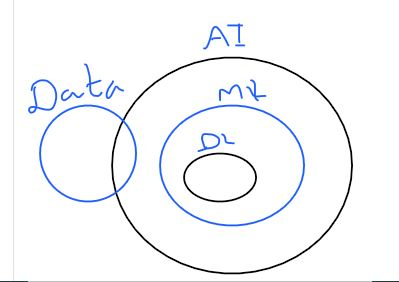
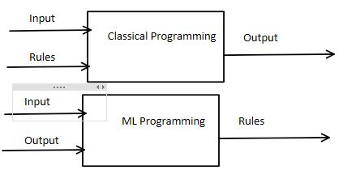
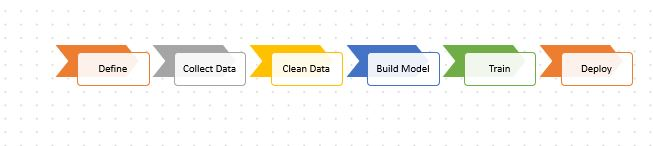

# Highlevel view

## AI
Imitate/perform tasks normally as human 
## Machine Learning
Ability to learn from the data without explicitly programming

### Machine Learning programming vs normal programming

# ML categories
	
1. Supervised (Regression, Binary, Classification)
	- Learn from the Labeled data 
2. Unsupervised (Clustering)
	- Grouping the data into  similar groups of clusters
3. Reinforcement 
	-  Decision Making from Uncertainty 
	- Learn from mistake and correct it by the user input

# 6 Steps involved in Data Science Life cycle

## 1. Define the problem
	- Identify the issue that we are going to solve [Background of the issue]
	- Issue really fit into Predictive/ Perspective use case or not [Ignore if the problem is descriptive]
	- Business benefits /Drivers
	- Scope
## 2.Collecting the data
	- Data Lake 
	- Do we require ETL
	- Data format[csv, json, xml, etc]
	- Volume, velocity, variety 
## 3. Clean the data [Numeric, Text, Classification] /  Exploratory the data 

	-  Univariate analysis (pd.Describe)
		- min
		- max
		- mode
		- Std
		- Quartile
		- Outliers 
		- confidence interval
	- Data type identification (pd.info)
	-  Visualize
		- Univariate
			- Bar - Categorical - Location, Balcony, Furnished/Unfurnished
			- Line - More no of Categorical,  continuous 
			- Histogram/ distplot 
			- Range/ Interval Type (Y - frequency)
		- Bivariate
			- Scatter Plot  
				- Correlation between two variables
				- Correlation ranges -1 to 1
				- X variable should be independent 
				- X1, X2 have same effect on the Y variable
				- Identify the impact on x on y
			- Pair Plot
				- All in one picture
			- Reg plot
			- Box Plot
				- Wishcus - MIN 25- 50-75 - Max
				- outliers
				- Distribution
			- Count Plot
				- SNS
				- Bar Chat
				- Categorical
			- Probability Density Function
			- Cumulative Density Function
			
## 4. Model Building

### Regression: (Relationship between variables)
- Linear regression
- Support Vector Machine 
- Decision regression
- Random Forrest regression
### Classification
- XGBoost
- ADA
- RandomForest
- K-Nearest neighbor 
### Unsupervised
- K-Means
- Random-Cut forest
- Principle Component Analysis
- Latent Dirichlet Allocation (LDA)
- Neural Topic Model (NTM)

## 5. Evaluate
### Regression
- Plots
- Residual Histogram
- Root Mean Square Error [RMSE]

### Classification
- Plots
- Confusion Matrix
- Recall, Precision, Accuracy, F1-Score, Area Under Curve [TPR vs FPR]
 
## 6. Deploy the Model

